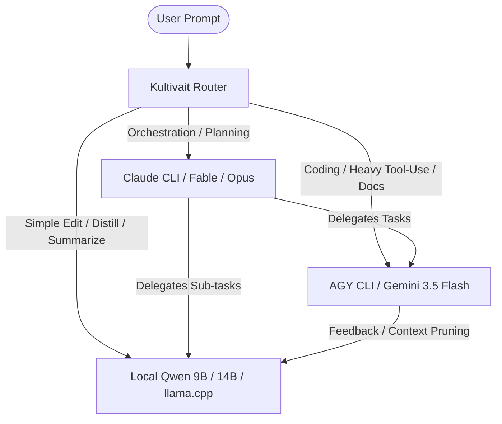

# TODO-AGY: Evaluation & Orchestration Experimentation Framework

This framework outlines the methodology, tasks, metrics, and scripts to experiment running and evaluating tasks across our hybrid LLM stack: **Claude CLI (Fable/Opus)** for high-level orchestration/planning, **AGY CLI (Gemini 3.5 Flash)** for fast tool-use/coding tasks, and **Qwen 9B/14B (local via llama.cpp/ollama)** for local processing, basic edits, and distillation.

---

## 1. Hybrid Stack Roles



- **Orchestration & Planning (Claude Fable/Opus)**: High-context planning, sub-agent spawning, multi-file architectural changes.
- **Coding, Tool-Use & Docs (AGY / Gemini 3.5 Flash)**: Writing code, script tasks, reading files, and drafting documentation. Large context window + high speed.
- **Local Auxiliary (Qwen 9B/14B / llama.cpp)**: Fast, free local tasks: unit test writing, simple regex conversion, context pruning (`kultivait prune`), and initial triage.

---

## 2. Experimental Task Suites

To gather comprehensive datapoints and prove the worth of this delegation model, we will run the following 5 target task suites.

### Task A: Research-Based Tasks
* **Goal**: Measure context retention, information extraction, and synthesis capability.
* **Test Task**: Feed a 30K-token developer log / chat transcript containing specific "planted facts" (versions, constraints, and dead ends) to the models.
* **Operation**: Distill the transcript into a clean, structured handover brief: `TASK`, `CONTEXT`, `PROGRESS`, `NEEDED`.
* **Execution**:
  - **Local**: `kultivait prune` (via Qwen)
  - **AGY**: `agy` (Gemini 3.5 Flash) with custom prompt
  - **Claude**: `claude -p` (Opus)
* **Metrics**: Planted-fact recall % (via `src/kultivait/evals.py`), tokens compressed ratio, execution time, and api cost.

### Task B: Documentation-Based Tasks
* **Goal**: Assess clarity, technical accuracy, formatting, and usability.
* **Test Task**: Read the source files in `src/kultivait/` and generate a complete user-facing `docs/API.md` outlining the OpenAI/Anthropic endpoint structures and CLI features.
* **Operation**: Generate documentation markdown.
* **Execution**: Run with and without context pruning, comparing raw generation to distilled-brief-based generation.
* **Metrics**: Markdown lint pass, readability index, alignment with source code (LLM-as-a-judge score), and cost.

### Task C: Coding & Test Scaffolding Tasks
* **Goal**: Measure code correctness, tool-calling speed, and iteration efficacy.
* **Test Task**: Implement a feature request (e.g. `Anthropic-endpoint tool support` or `escalation advisory metadata`).
* **Operation**: Write the code in `src/kultivait/` and a corresponding test suite in `tests/`.
* **Execution**: Let Fable plan the task and write a specification brief, then delegate the coding and testing directly to the AGY CLI or Qwen.
* **Metrics**: `pytest` run pass/fail status, number of iteration turns needed to fix lint/test errors, time-to-completion, and cost.

### Task E: Repository Pull-Request & CI Management
* **Goal**: Evaluate utility as an autonomous PR reviewer and local CI pipeline keeper.
* **Test Task**: Run a local git diff review on an active branch, checks for lint/test coverage, and drafts a PR description and feedback summary.
* **Operation**: Run a script that performs `git diff`, invokes the models, and formats the output into a markdown PR review.
* **Execution**: Let Qwen do the initial change summary, and AGY/Gemini generate the final structured code review.
* **Metrics**: Quality of feedback (number of critical issues identified vs. false positives), generation speed, and token cost.

### Task F: Deployment Operations
* **Goal**: Measure configuration generation and build validation efficiency.
* **Test Task**: Validate package versioning, build a wheel locally via `uv build`, verify `vercel.json` configurations, and run a smoke test.
* **Operation**: Write a bootstrap shell script that executes commands, catches errors, and delegates fixing to the model.
* **Execution**: AGY runs the commands, collects terminal stderr, and updates configurations.
* **Metrics**: Deploy pipeline success rate, latency of the validation loop, and cost.

---

## 3. Metric Logging & Ledger Integration

To save every datapoint, we will log all experimental runs to the `~/.kultivait/ledger.jsonl` using the existing proxy, plus a dedicated evaluation script `experiments/run_experiment.py`.

### Target Ledger Schema (Extra Fields)
Every experiment run will append the following fields in the ledger `record(..., **extra)` call:
```json
{
  "experiment_id": "exp_2026-07-15_coding_v1",
  "task_type": "coding",
  "orchestrator": "claude-fable",
  "worker": "agy-gemini-3.5-flash",
  "duration_seconds": 45.2,
  "test_passed": true,
  "recompilation_attempts": 1,
  "prompt_tokens": 12845,
  "completion_tokens": 820,
  "estimated_cost_usd": 0.038,
  "actual_cost_usd": 0.002,
  "savings_usd": 0.036
}
```

---

## 4. Checklist: TODO-AGY Action Plan

Use the following check-list to execute the experiments and establish the routing-delegation pipeline.

### [ ] Phase 1: Experiment Infrastructure Setup
- [ ] **Create Experiment Harness** (`experiments/run_experiment.py`):
  - Setup a script to run specific prompts, record outputs, and execute validations (tests, lints).
  - Automatically calculate cost and append records to `~/.kultivait/ledger.jsonl`.
- [ ] **Configure Local Model Tiers**:
  - Confirm local `qwen3:9b` or `qwen3:14b` is running in `llama.cpp` or `ollama`.
  - Validate model tiers in `~/.kultivait/config.toml` to ensure correct classification routing.
- [ ] **Test Tool Call Passthrough**:
  - Run a smoke test to ensure `agy` and the local model receive tool calls correctly via `kultivait`.

### [ ] Phase 2: Running the Task Suite
- [ ] **Run Research Recall Tests**:
  - Execute `uv run python experiments/distill_eval/run.py` on the local model and AGY.
  - Compare fact recall rates (v1 vs. v2 prompts).
- [ ] **Run Documentation Generation**:
  - Prompt AGY and Qwen to document the `kultivait` CLI features.
  - Grade the outputs using a structured LLM-as-a-judge prompt.
- [ ] **Run Delegated Coding Tasks**:
  - Ask Claude to orchestrate: generate a task spec for adding "escalation metadata" to `/v1/chat/completions`.
  - Delegate the actual coding to AGY CLI. Validate using `uv run pytest`.
- [ ] **Run CI/PR Review Benchmark**:
  - Create a mock PR with a known bug (e.g., race condition or context truncation).
  - Run the PR reviewer prompt on all three tiers. Check which tier flags the bug.
- [ ] **Run Local Deployment Dry-Run**:
  - Run a mock build and deploy sequence. Measure model intervention time and correctness of environment adjustments.

### [ ] Phase 3: Analysis & Worth Proof
- [ ] **Generate Savings Report**:
  - Execute `uv run kultivait harvest` to aggregate the savings.
  - Generate a custom summary chart showing Cost vs. Quality tradeoffs across the three models.
- [ ] **Create the Final Worth Case**:
  - Formulate a clean report detailing:
    1. *Cost Reduction*: How much did Qwen + AGY save compared to pure Claude?
    2. *Orchestration Efficacy*: How successfully did Claude delegate and prune context to avoid hitting limits?
    3. *Speed/Inference Profile*: Latency improvements using local Qwen for simple requests.

---

## 5. Script Blueprints

### `experiments/run_experiment.py`
Below is the draft structure for the evaluation script:

```python
import time
import httpx
import json
from pathlib import Path

KULTIVAIT_URL = "http://localhost:4114/v1/chat/completions"

def run_task(task_id: str, task_type: str, model_tier: str, prompt: str):
    payload = {
        "model": model_tier,
        "messages": [{"role": "user", "content": prompt}],
        "temperature": 0.0
    }
    
    start_time = time.time()
    try:
        response = httpx.post(KULTIVAIT_URL, json=payload, timeout=300.0)
        response.raise_for_status()
        data = response.json()
        duration = time.time() - start_time
        
        # Extract headers or metadata returned by kultivait
        meta = data.get("kultivait_meta", {})
        print(f"Task {task_id} completed in {duration:.2f}s via {meta.get('served_tier')}")
        return data, duration
    except Exception as e:
        print(f"Failed to run task {task_id}: {e}")
        return None, 0.0
```

> [!TIP]
> Keep `KULTIVAIT_RUNTIME` pointed to your active local runtime (`ollama` or `llamacpp`) to bypass cloud costs during local-only tasks.
